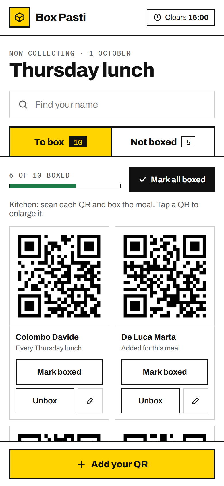
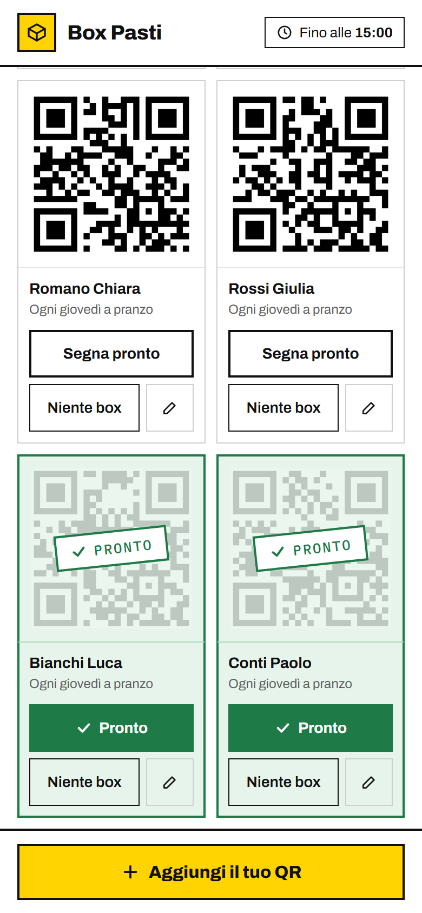
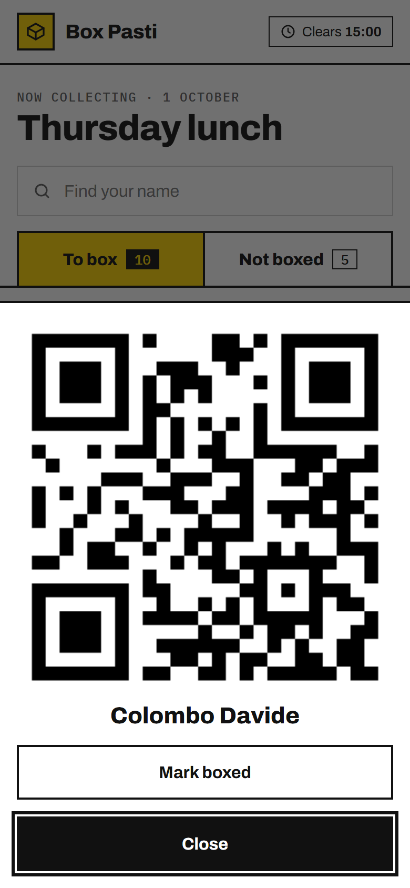
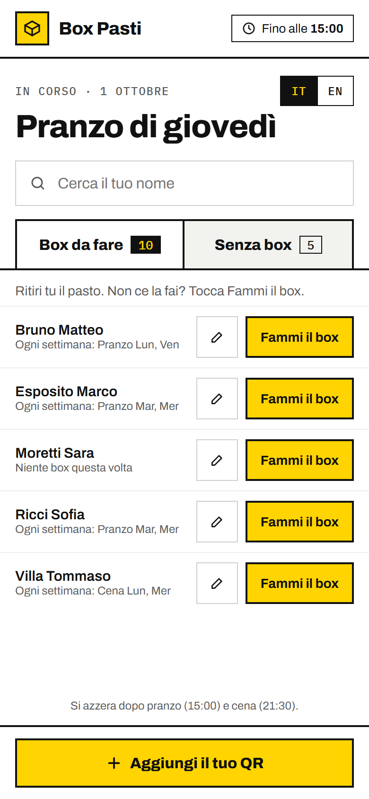
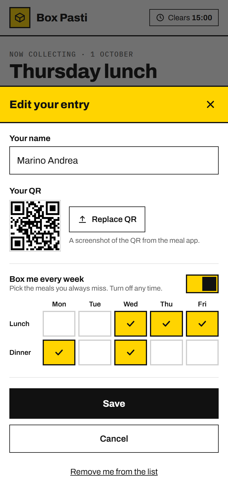

# Box Pasti

A one-page list that shows the kitchen whose meal QR to scan and box at each lunch and dinner.
Students who can't make it to the canteen add themselves, and the kitchen ticks them off as they box.
It's a static site on GitHub Pages, with the shared data in Supabase (free tier). There's no login.

<p>
  
  
  
</p>
<p>
  
  
</p>

<sub>Screenshots use made-up people and fake QR codes.</sub>

```
index.html                page
style.css                 styles
app.js                    logic (Supabase URL and publishable key at the top)
supabase/schema.sql       tables, security policies, Realtime, QR storage bucket
docs/screenshots/         images for this README
```

## How it works

**For students**

- **Add your QR** once: your name, a screenshot of the QR from the meal app, and, if you like, the meals you always miss each week.
- **Box me** or **Unbox** changes only the current meal. For example, `Box me` on Thursday lunch doesn't touch Friday.

**For the kitchen**

- **To box** shows everyone whose meal needs boxing right now. Tap a QR to enlarge it for scanning.
- Tap **Mark boxed** on a card when it's done, or **Mark all boxed** at the top once you've finished the batch.
  Boxed cards turn green, show a "Boxed" stamp and move to the bottom. The bar at the top counts how many are done.
- If someone adds themselves after that, their card appears at the top without the green, so it's easy to spot.
  Tap **✓ Boxed** on a card to undo it.

**Rules**

- Rome time decides the meal: lunch before 15:00, dinner until 21:30, then the next day's lunch. Weekends show Monday lunch.
- Overrides (`Box me` / `Unbox`) and kitchen marks are saved for one meal only, keyed like `2026-10-01-L`.
  Each meal has a new key, so the list resets by itself twice a day. Rows older than 7 days are deleted when someone opens the page.
- When someone uploads a screenshot, the page finds the QR in it, crops it, shrinks it to 400px and saves it as a PNG.
- Every open phone updates live through Supabase Realtime.
